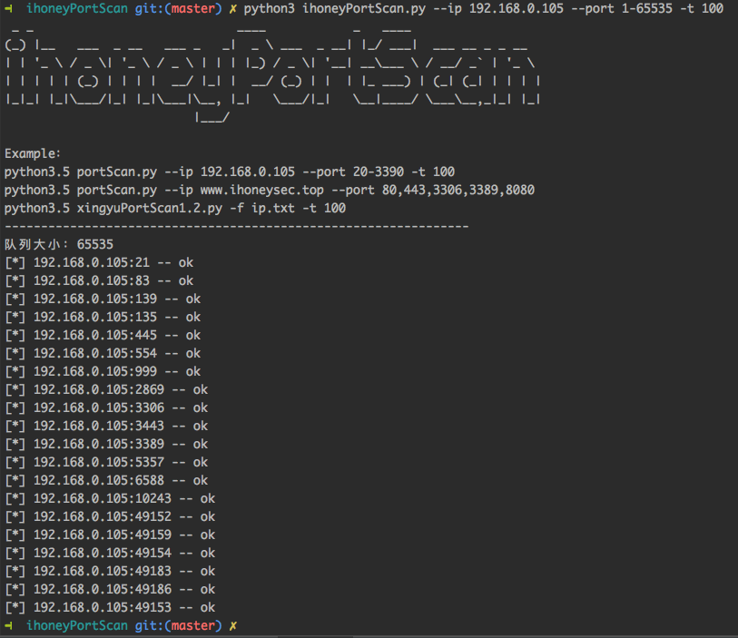

# ihoneyPortScan v1.2 端口扫描器

## 简介：
* 如nmap等传统的扫描太慢且有些信息没必要扫描，本程序其实和masscan效果一样，但效果不一定有masscan好。
* 本程序特点是使用python的telnet库来扫描端口，而不是常规的socket探测方式，现在已经有很多防火墙会拦截socket方式探测，但大多部分对telnet还是不拦截的。
* ip地址和域名都可以扫描，请尽量扫描ip地址，除非此域名确认没有waf、CDN。
* 扫描结果将保存在ok.txt文件中
* 请使用python3.5版本运行

result: 

## 安装依赖模块：
	多线程、队列、telnet库等
	pip3.5 install queue threading telnetlib base64 argparse ipaddress

## 可选参数：
	-h,--help 查看使用帮助 
	-t 可选参数：指定线程数，默认是一个线程
	--port 指定扫描端口，支持三种格式：(1)80  (2)80,443,3306,3389  (3)1-65535   

## 如果端口未指定，将默认扫描以下端口：
	[21, 22, 23, 53, 80, 111, 139, 161, 389, 443, 445, 512, 513, 514,
	873, 1025, 1433, 1521, 3128, 3306, 3311, 3312, 3389, 5432, 5900,
	5984, 6082, 6379, 7001, 7002, 8000, 8080, 8081, 8090, 9000, 9090,
	8888, 9200, 9300, 10000, 11211, 27017, 27018, 50000, 50030, 50070]

## 必选参数（二选一）：
	-f   指定存放ip的文件，每一行一个ip或域名
	--ip 可以指定ip地址或者域名

## 使用样例：
	python3.5 ihoneyPortScan.py --ip 192.168.0.105 --port 20-3390 -t 100
	python3.5 ihoneyPortScan.py --ip www.xxx.top --port 80,443,3306,3389,8080
	python3.5 ihoneyPortScan.py -f ip.txt -t 100

